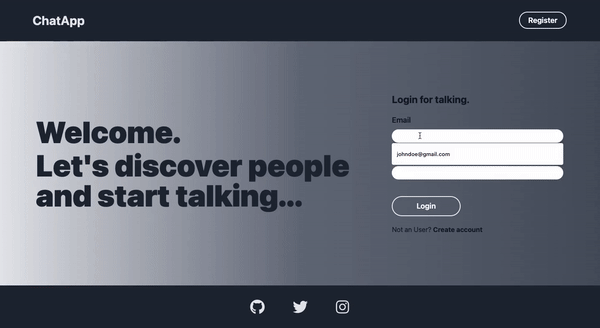

# Chat App



---

## Demo

Online deployment of this project is available at [Chat App](https://chat-app-ayktldg.vercel.app/).

You can use the below credentials to test the app.

```
username: johndoe
email: johndoe@gmail.com
password: 1234test
```

```
username: janedoe
email: janedoe@gmail.com
password: 1234test
```

## Features

- Register and log in with email
- Listing all users
- Start a real-time chat with any user on browser.

## Technologies

Firebase, Vue, Vuex, Vue-Router, Vee Validate, Vuex Persist, Tailwind CSS.

## Project setup

```
npm install
```

### Compiles and hot-reloads for development

```
npm run serve
```

### Compiles and minifies for production

```
npm run build
```

### Lints and fixes files

```
npm run lint
```

### Customize configuration

See [Configuration Reference](https://cli.vuejs.org/config/).
